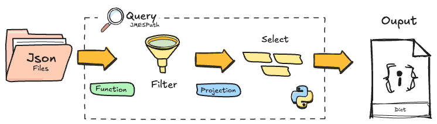

[](https://www.buymeacoffee.com/r0mymendez)

---

# Efficiently Querying JSON Data in Python: Exploring the MET Museum's Artworks

While working on several projects that required processing complex and nested **JSON** data in **🐍Python**, I explored various methods for handling these structures. I eventually discovered the **JMESPath** library, which aims to simplify querying and filtering JSON structures.

In this article, I demonstrate how to use the **JMESPath** library to query and filter **JSON** data. To find a suitable dataset for these examples, I thought about one of my favorite activities when I travel: visiting museums. The 🏛️ **Metropolitan Museum of Art (MET)**, one of the largest and most prestigious museums in the world, seemed like a perfect choice, as it offers an **API** that provides access to a vast collection of artwork. In this article, we’ll focus on the works of **Vincent van Gogh** and the collections of European painters to explore the potential of **JMESPath** for effectively handling JSON data.

Additionally, I will showcase how to use **AWS CLI** to interact with the data stored in a 🪣 bucket that contains the downloaded **JSON files** from the MET API.


---

## 🏛️ MET Museum of New York

The **Metropolitan Museum of Art (MET)**, founded in `1870` and situated in Manhattan, 🗽 New York City, stands as one of the world’s most prestigious cultural institutions. Spanning over `186,000` square meters, the museum houses a diverse collection that encompasses more than 🖼️`5,000 years` of art history. Through its public API, the MET offers detailed insights into its `19 departments`, featuring an extensive array of works that range from ancient Egyptian, Greek, and Roman art to masterpieces by renowned artists such as Monet, Van Gogh, and Raphael.

The following 📊 plot illustrates the distribution of artworks across these various departments, using data retrieved from the MET's public API.


---

## 📄 Introduction to JMESPath

### What is JMESPath?

**JMESPath** is a query language for JSON that allows you to search, extract, and manipulate elements from a JSON document. This query language can be implemented with the Azure and AWS CLIs, where it simplifies filtering and transforming JSON data. 




---

### Installation of JMESPath

To get started, you need to install the **JMESPath** library. The version used in this tutorial is `'0.10.0'`. Simply run the following command:

```bash
pip install jmespath
```

---

## 📄 JSON Data Structure

JSON, or JavaScript Object Notation, is a lightweight data format commonly used for data interchange between a server and a client. Here are key elements of JSON structure:

- **🏷️ Main Object:** The JSON object starts and ends with {}, encapsulating all data.
- **🏷️ Key-Value Pair:** Each element is a key-value pair, where the key is a string, and the value can be any data type (e.g., string, number, boolean, array, object).
- **🏷️ Nested JSON Object:** JSON objects can contain other objects within them, forming nested structures for complex data.
- **🏷️ Array of Objects:** Arrays [ ] hold lists of values, including other objects, useful for grouping similar elements.


<br>


---

# Tutorial 📚
If you want to implement all the following use cases, you can follow the code in `main.ipynb`. This file contains all the code needed to explore the MET Museum API and apply various queries using the **JMESPath** library. Additionally, there are three extra cases demonstrating how to implement this functionality using the AWS CLI, allowing you to interact with data stored in a bucket that contains the downloaded files from the MET API.


